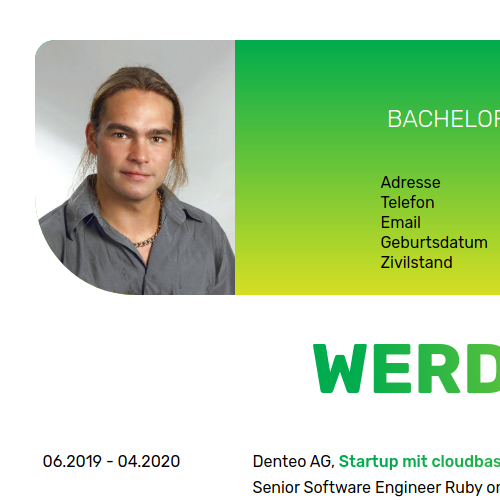
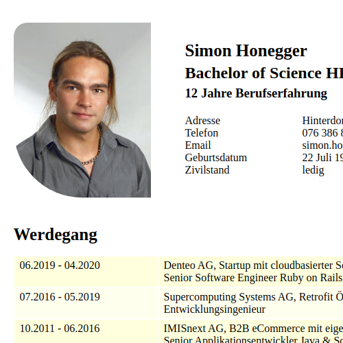

# CeeVee
Theme-able CV Generator

Generates PDF and HTML for a CV written in XML

## Examples


|  Theme       | CV           | Cover Letter  |
| ------------- |:-------------:| -----:|
| Green      | [](http://hoene84.github.io/CeeVee/example/honegger/green/cv/cv.html) <br> [PDF](http://hoene84.github.io/CeeVee/example/honegger/green/cv/cv.pdf)| [](http://hoene84.github.io/CeeVee/example/honegger/green/cover_letter/cover_letter.html) <br> [PDF](http://hoene84.github.io/CeeVee/example/honegger/green/cover_letter/cover_letter.pdf) |
| Chimpy      | [](http://hoene84.github.io/CeeVee/example/honegger/chimpy/cv/cv.html) <br> [PDF](http://hoene84.github.io/CeeVee/example/honegger/chimpy/cv/cv.pdf) | [](http://hoene84.github.io/CeeVee/example/honegger/chimpy/cover_letter/cover_letter.html) <br> [PDF](http://hoene84.github.io/CeeVee/example/honegger/chimpy/cover_letter/cover_letter.pdf) |
| ZKB      | [](http://hoene84.github.io/CeeVee/example/honegger/zkb/cv/cv.html) <br> [PDF](http://hoene84.github.io/CeeVee/example/honegger/zkb/cv/cv.pdf) | [](http://hoene84.github.io/CeeVee/example/honegger/zkb/cover_letter/cover_letter.html) <br> [PDF](http://hoene84.github.io/CeeVee/example/honegger/zkb/cover_letter/cover_letter.pdf) |
| None      | [](http://hoene84.github.io/CeeVee/example/honegger/none/cv/cv.html) <br> [PDF](http://hoene84.github.io/CeeVee/example/honegger/none/cv/cv.pdf) | [](http://hoene84.github.io/CeeVee/example/honegger/none/cover_letter/cover_letter.html) <br> [PDF](http://hoene84.github.io/CeeVee/example/honegger/none/cover_letter/cover_letter.pdf) |


## Required
### Linux System

Only 3 standard packages are required:

```
sudo apt-get install libsaxonb-java libxml2-utils make`
```

## Getting started

### Write your CV

First write your CV. Start from scratch or use my CV located at `data/hongger/cv.xml` as template.

The xml has to be well-formed and valid. 
I recommend to use an editor with XML Schema support.
the free IntelliJ IDEA Community Edition (https://www.jetbrains.com/de-de/idea/download/) does this job very well.

The cv.xml should look like this one:

```xml
<?xml version="1.0" encoding="UTF-8"?>
<cv xmlns:xsi="http://www.w3.org/2001/XMLSchema-instance" xsi:noNamespaceSchemaLocation="../../src/cv.xsd" international="false">
    <layout type="cv">
        <theme>green</theme>
    </layout>
    <person>
        <forename>Simon</forename>
        <name>Honegger</name>
        <title>Bachelor of Science HES-SO in Informatik</title>
        <contact>
            <address>
                <street>Hinterdorfstrasse</street>
                <streetnumber>10</streetnumber>
                <zip countryIsoCode="CH">8157</zip>
                <location>Dielsdorf</location>
            </address>
            <phone type="cellPhone">
                <countryCode>41</countryCode>
                <areaCode>76</areaCode>
                <number>386 82 56</number>
            </phone>
            <email>simon.honegger@gmail.com</email>
        </contact>
        <experience>12</experience>
        <birthday day="22" month="7" year="1984"/>
        <maritalStatus>ledig</maritalStatus>
        <picture>cv_honegger_photo.jpg</picture>
    </person>
    <career title="Career">
        <activity>
            <from year="2019" month="06" style="plain" />
            <to year="2020" month="04" style="plain"/>
            <description>Some short description of the activity</description>
            <certificate>Bachelor of Science HES-SO in Informatik (bilingue Franz./Deutsch)</certificate>
        </activity>
    </career>

    <skills title="Skills">
        <skillgroup title="Programming Languages">
            <solidskill etc="false">
                <skill id="java" logo="skills/java_ee.png">!?Java?!</skill>
                <skill id="ruby">Ruby</skill>
            </solidskill>
            <goodskill etc="true">
                <skill id="cplusplus" logo="skills/CPlusPlus.png">C++</skill>
            </goodskill>
        </skillgroup>
    </skills>

    <certificats title="Certificats">
        <activity>
            <date year="2011"/>
            <description>Certified Secure Web Developer (CSWD)</description>
        </activity>
    </certificats>

    <experiences title="Experiences">
        <experiance>
            <period>
                <company name="Denteo AG" logo="logo_denteo.png" />
                <from year="2019" month="06" style="plain" />
                <to year="2020" month="04" style="plain"/>
                <function>Full-Stack Senior Entwickler in Festanstellung</function>
                <project title="Denteo - Dentalpraxis Cloud Software Startup" id="denteo">
                    <activity>A task done at this job</activity>
                    <activity>Another task done at this job</activity>
                    <skillrefs location="right" orientation="vertical">
                        <skillref>rails</skillref>
                    </skillrefs>
                </project>
            </period>
        </experiance>
    </experiences>

    <projects title="Private Projects">
        <activity link="https://github.com/Hoene84/CeeVee" id="ceevee">
            <from year="2015"/>
            <to style="text">Aktuell</to>
            <title>CeeVee</title>
            <description>CV Generator: XML -> HTML und PDF\!?Das Resultat?! wird z.Zt. kritisch betrachtet.</description>
            <skillrefs location="right" orientation="horizontal">
                <skillref>xml</skillref>
                <skillref>html</skillref>
            </skillrefs>
        </activity>
    </projects>

    <trainings title="Trainings">
        <activity>
            <date year="2018" month="9"/>
            <description>CH Open Workshop-Tage 2018</description>
        </activity>
    </trainings>

    <languages title="Sprachen">
        <skill id="de" level="native" logo="flags/flag-de.png">German</skill>
        <skill id="fr" level="fluent" logo="flags/flag-fr.png">French</skill>
        <skill id="en" level="good" logo="flags/flag-en.png">English</skill>
    </languages>
</cv>
```

Here is an example of a cover_letter XML:

```xml
<?xml version="1.0" encoding="UTF-8"?>
<coverletter xmlns:xsi="http://www.w3.org/2001/XMLSchema-instance" xsi:noNamespaceSchemaLocation="../../src/cover_letter.xsd">
    <layout type="cover_letter">
        <theme>green</theme>
    </layout>
    <date day="05" month="5" year="2020"/>
    <subject>Bewerbung als !?Full Stack-Entwickler?!</subject>
    <content>
        Sehr geehrte Damen und Herren,
    </content>
    <content>
        Lorem ipsum dolor sit amet, his no simul deleniti ocurreret, qui in primis insolens. Sed in ipsum labore corpora. Te vix vero vocibus praesent, pri te essent maluisset. Mea iusto postulant ne. Eam at offendit deterruisset, eam adhuc nonumy corpora no. Sit eu quem delicatissimi, elit gubergren mea et. Quo te fastidii phaedrum rationibus, nec minimum argumentum intellegebat no.
    </content>
    <salutation>Mit besten Grüssen,</salutation>
    <fullname>Simon Honegger</fullname>
</coverletter>
```

### Generate

To generate, use on top level the command :
```
make
```
generates `target/cv.html` and `target/cv.pdf` using `data/honegger/cv.xml`

To generate a cover letter, use:
```
make PRODUCT=cover_letter
```  
generates `target/cover_letter.html` and `target/cover_letter.pdf` using `data/honegger/cover_letter.xml`

To customize your input, use:
```
make DATA=yourname
```  
generates `target/cv.html` and `target/cv.pdf` using `data/yourname/cv.xml`

#### Publish

The target folder is excluded for git. If you want to publish the artifact use:
```
make example DATA=yourname
```  

This regenerates the artifact and puts them in the example folder under `data_name/first_theme/product`.

After pushing, you can access the artifact under http://hoene84.github.io/CeeVee/example/[data_name]/[first_theme]/[product]/[product].html

#### Other valid make targets

validate: only validates the source xml  
html: only generates html  
pdf: generates pdf (and html as pre-step)  
example: regenerates artifacts and puts them in the example folder under `data_name/first_theme/product`  

### Your own style

create a css file `style/theme_name.css`

```css
div.person
{
    background-color: blue;
}
```

to apply the style, add a theme tag to your XML:
```css
    ...
    <layout type="cover_letter">
        <theme>theme_name</theme>
    </layout>
    ...
```

Multiple themes are allowed and applied in the order as declared  
```css
    ...
    <layout type="cover_letter">
        <theme>theme1</theme>
        <theme>theme2</theme> <!-- extends and overwrites parts of theme1 -->
    </layout>
    ...
```

### Add scripts

create a js file `js/alerter.js`

```js
alert('alert');
```

to include the script, add a script tag to your XML:
```css
    ...
    <layout type="cover_letter">
        <script>alerter</theme>
    </layout>
    ...
```

To include external script, use:
```css
...
<layout type="cover_letter">
    <extScript>https://ajax.googleapis.com/ajax/libs/webfont/1.6.26/webfont.js</extScript>
    <script>alerter</theme>
</layout>
...
```
Also here, the declaration order matters. 


## Directories

1. `data` 
  * the content of your CV or cover letter in XML
  * any assets used in your CV or cover letter 
2. `js` if you need some Javascript code to layout your CV or make it interactive, place it here.
3. `src`
  * transformation logic
  * XML schemas defining valid input 
4. `style`
  * includable themes (css)
  * if you want to customize your CV, place the CSS files here 
5. `target`
  * After successful generation, you will find the results here
6. `examples`
  * some example results
